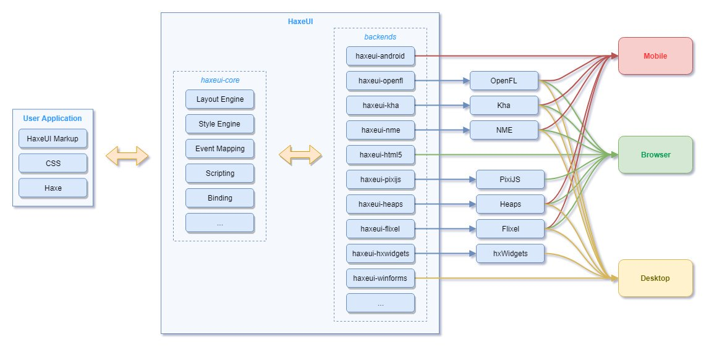

Welcome
================================

This guide will serve as a starting point to get your system configured to write rich, cross platform, cross framework Haxe GUI applications.

By the end of this guide you will have a fully functioning HaxeUI installation (with a least one [backend](backends/index.html)) and a simple "[Hello World](hello-world.html)" application.

Backends
-------------------------
HaxeUI can target multiple frameworks (including native frameworks) by utilising a "backend system"

This means that the logic of HaxeUI (inside haxeui-core) is separated from the code that actually performs the drawing, or in the case of native GUIs, creates the native controls. There are many backends to choose from, and no limitation on new backends that could be written.

Backends come in two flavours: Composite Backends and Native Backends

#### Composite Backends

Composite backends are backends that usually utilise some type of drawing framework, this means that the logic of the control is 100% handled inside HaxeUI and the drawing is delegated to the backend.

One backend that is an exception this is haxeui-html5 which doesnt really "draw" anything, instead the backend is responsible for creating a set of DOM nodes

#### Native Backends

Native backends differ from composite backends in that the creating of the actual component is delegated to the backend, this is useful for creating 100% native user interfaces while still leveraging the outward facing HaxeUI api.