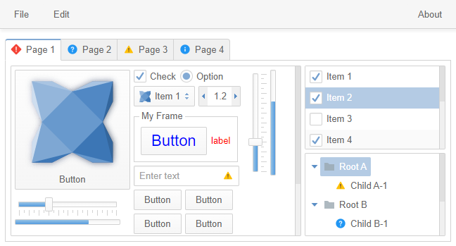

haxeui-html5
================================

haxeui-html5 is the pure HTML5 backend for HaxeUI. It has no other framework dependency except haxeui-core itself and outputs a DOM tree.



_Note: haxeui-html is considered a "hybrid" backend, this is because it can create composite components as well as native components (native to the browser), where they are available, in the same GUI (as pictured below)._


## Installation
haxeui-html5 has a dependency to haxeui-core, and so that too must be installed. Once haxeui-core is installed, haxeui-html5 can be installed using:

```
haxelib install haxeui-html5
```

## Usage
The simplest method to create a new HTML5 application that is HaxeUI ready is to use the HaxeUI command line tools. These tools will allow you to start a new project rapidly with HaxeUI support baked in. To create a new skeleton application using haxeui-html5 create a new folder and use the following command:

```
haxelib run haxeui-core create html5
```

If however you already have an existing application, then incorporating HaxeUI into that application is straightforward:

### Haxe build.hxml

If you are using a command line build (via a .hxml file) then add these two lines:

```
-lib haxeui-core
-lib haxeui-html5
```

If you are using an IDE, like Haxe Develop, add these lines via the project settings window (or the appropriate place for your IDE of choice).

## Toolkit initialisation and usage

Initialising the toolkit requires you to add this single line somewhere before you start to actually use HaxeUI in your application:

```haxe
Toolkit.init();
```

## HTML5 specifics

As well as using the generic `Screen.instance.addComponent`, it is also possible to add components directly to any other DOM node: the haxeui-html5 backend exposes a special element property for this purpose. Eg:

```haxe
js.Browser.document.getElementById("myContainer").appendChild(main.element);
```

### Initialisation options

The configuration options that may be passed to Tookit.init() are as follows:

```haxe
Toolkit.init({
    // where 'Screen' will place components (defaults to the document body)
    container: js.Browser.document.getElementById("myContainer")
});
```

## Native components

HTML5 supports various native versions of components, and therefore so does HaxeUI. There are a few different ways to do this:

### Using a theme (applies to all relevant components)
```haxe
Toolkit.theme = "native"; // will try to use native components where possible
```

### Using haxe code (applies to single component)
```haxe
var button:Button = new Button();
button.native = true; // this component alone will be native
```

### Using an inline style (applies to single component)
```xml
<button text="Native" style="native:true;" />
```

### Using CSS (applies to groups of components)
```css
.button, #myNativeButton, .myNativeStyle {
    native: true;
}
```